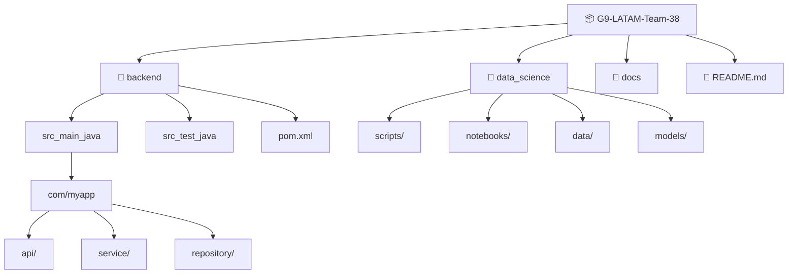
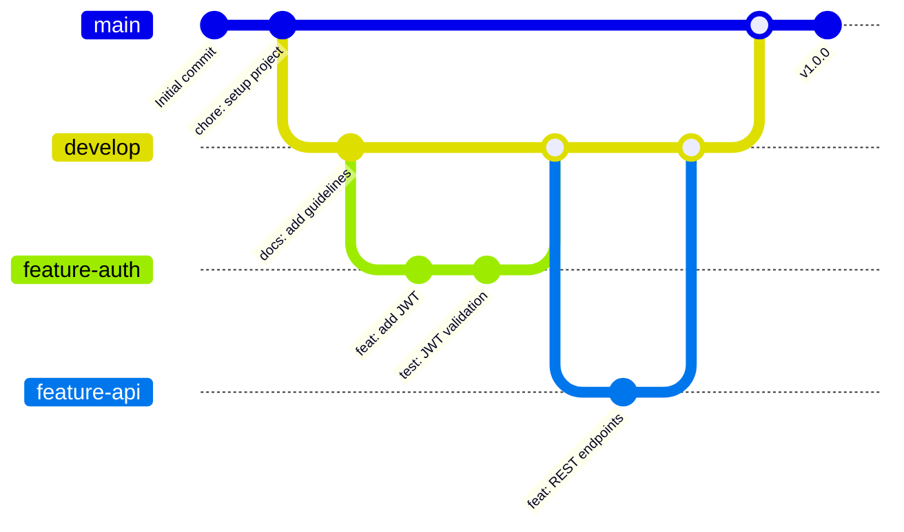
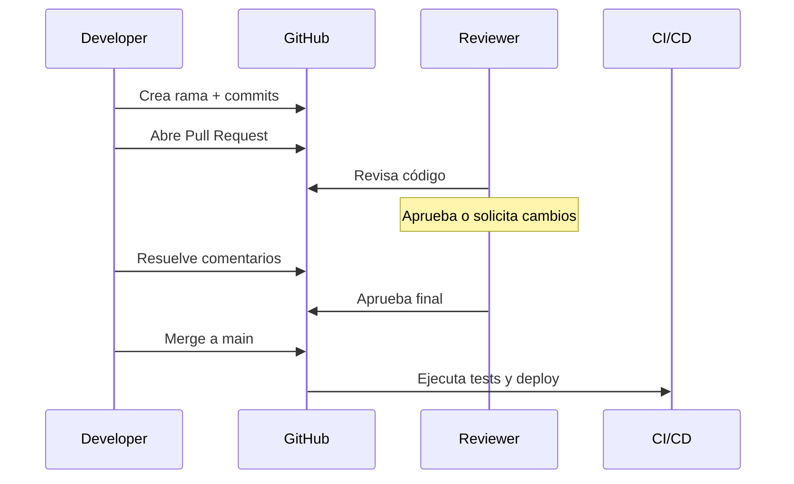

# Guía de Convenciones para Proyectos Java/Python en Hackathons

> **Objetivo:** Definir un estándar de nomenclatura, organización del repositorio y flujo de trabajo para que todo el equipo trabaje de forma consistente.

## Tabla de contenido

1. [Convenciones de nomenclatura](#1-convenciones-de-nomenclatura)
2. [Estructura del proyecto](#2-estructura-recomendada)
3. [Convenciones para Java](#3-convenciones-java)
4. [Convenciones para Python](#4-convenciones-python)
5. [Estrategia de ramas (Git Flow simplificado)](#5-estrategia-de-ramas)
6. [Conventional Commits](#6-conventional-commits)
7. [Flujo de Pull Requests](#7-flujo-de-pull-requests)
8. [Revisión de código](#8-revisión-de-código)
9. [Diagramas Mermaid](#9-diagramas-mermaid)
10. [Buenas prácticas](#10-buenas-prácticas)
11. [Control de versiones](#11-control-de-versiones)
12. [Gestión de dependencias](#12-gestión-de-dependencias)
13. [Documentación](#13-documentación)

---

# 1. Convenciones de nomenclatura

## Archivos y carpetas

Utilizar **guiones bajos (`_`)** para separar palabras en nombres de archivos y carpetas.

### Ejemplos

```text
user_service.java
database_config.py
data_processing/
src_main_java/
utils_helpers.py
api_endpoints.java
```

### Beneficios

- ✅ Compatible con PEP 8 (estándar Python)
- ✅ Evita confusión con paquetes Java (que usan puntos)
- ✅ Fácil de escribir desde terminal (sin problemas con shell)
- ✅ Mayor legibilidad y consistencia
- ✅ Funciona bien en URLs y scripts

---

## Branches (Ramas)

Utilizar **guiones medios (`-`)** para separar palabras en nombres de ramas.

### Ejemplos

```text
feature-user-auth
feature-api-endpoints
fix-login-error
fix-database-connection
experiment-rag
ds-feature-engineering
hotfix-prod-error
refactor-api-layer
```

### ⚠️ Prohibido

- ❌ Espacios: `feature user auth`
- ❌ Puntos: `feature.user.auth`
- ❌ Guiones bajos: `feature_user_auth`
- ❌ Mayúsculas: `Feature-User-Auth`

### Razones

- Git estándar internacional
- Compatible con CI/CD pipelines
- Fácil de procesar en scripts
- Evita errores de referencia

---

# 2. Estructura recomendada

```text
G9-LATAM-Team-38/
├── backend/
│   ├── src_main_java/
│   │   └── com/myapp/
│   │       ├── api/
│   │       │   ├── controller/
│   │       │   └── dto/
│   │       ├── service/
│   │       ├── repository/
│   │       ├── model/
│   │       ├── config/
│   │       └── exception/
│   ├── src_test_java/
│   ├── pom.xml
│   ├── .env.example
│   └── README.md
├── data_science/
│   ├── scripts/
│   │   ├── data_preprocessing.py
│   │   ├── model_training.py
│   │   ├── analysis.py
│   │   └── utils_helpers.py
│   ├── notebooks/
│   │   ├── exploratory_analysis.ipynb
│   │   └── model_evaluation.ipynb
│   ├── data/
│   │   ├── raw/
│   │   ├── processed/
│   │   └── .gitkeep
│   ├── models/
│   │   └── .gitkeep
│   ├── config.py
│   ├── requirements.txt
│   ├── .env.example
│   └── README.md
├── docs/
│   ├── ARCHITECTURE.md
│   ├── API_DOCUMENTATION.md
│   ├── SETUP_GUIDE.md
│   └── DEPLOYMENT.md
├── tests/
│   ├── integration/
│   └── e2e/
├── .gitignore
├── .env.example
├── README.md
├── BRANCHING_STRATEGY.md
├── CONTRIBUTING.md
└── LICENSE
```

---

# 3. Convenciones Java

Seguir [Google Java Style Guide](https://google.github.io/styleguide/javaguide.html).

| Elemento | Convención | Ejemplo |
|----------|-----------|---------|
| **Clases** | `PascalCase` | `UserService`, `AuthController` |
| **Interfaces** | `PascalCase` | `UserRepository`, `PaymentGateway` |
| **Métodos** | `camelCase` | `getUserById()`, `calculateTotal()` |
| **Variables** | `camelCase` | `userName`, `totalAmount` |
| **Constantes** | `UPPER_SNAKE_CASE` | `MAX_RETRIES`, `API_TIMEOUT` |
| **Paquetes** | `lowercase.with.dots` | `com.myapp.service` |
| **Archivos** | `snake_case` | `user_service.java` |

### Ejemplo completo

```java
package com.myapp.service;

import com.myapp.model.User;
import com.myapp.repository.UserRepository;

public class UserService {

    private static final int MAX_RETRIES = 3;
    private final UserRepository userRepository;

    public UserService(UserRepository userRepository) {
        this.userRepository = userRepository;
    }

    public User getUserById(Long id) {
        return userRepository.findById(id)
            .orElseThrow(() -> new UserNotFoundException("User not found"));
    }

    public User createUser(String name, String email) {
        User user = new User(name, email);
        return userRepository.save(user);
    }
}
```

### Buenas prácticas Java

- ✅ Usar `final` para variables que no cambian
- ✅ Inyección de dependencias (Spring)
- ✅ Logging con SLF4J
- ✅ Manejo de excepciones específicas
- ✅ Comentarios JavaDoc para métodos públicos
- ✅ Usar `java.util.Optional` en lugar de `null`

---

# 4. Convenciones Python

Seguir [PEP 8](https://pep8.org/).

| Elemento | Convención | Ejemplo |
|----------|-----------|---------|
| **Módulos/Archivos** | `snake_case` | `user_service.py` |
| **Funciones** | `snake_case` | `get_user()`, `calculate_total()` |
| **Variables** | `snake_case` | `user_name`, `total_amount` |
| **Clases** | `PascalCase` | `UserService`, `DataProcessor` |
| **Constantes** | `UPPER_SNAKE_CASE` | `MAX_RETRIES`, `API_TIMEOUT` |

### Ejemplo completo

```python
"""Module for user service operations."""

from typing import Optional
from dataclasses import dataclass
import logging

logger = logging.getLogger(__name__)

MAX_RETRIES = 3
API_TIMEOUT = 30


@dataclass
class User:
    """Represents a user entity."""
    id: int
    name: str
    email: str


class UserService:
    """Service for managing user operations."""

    def __init__(self, repository):
        self.repository = repository

    def get_user(self, user_id: int) -> Optional[User]:
        """Retrieve a user by ID.
        
        Args:
            user_id: The user identifier.
            
        Returns:
            User object or None if not found.
        """
        try:
            return self.repository.find_by_id(user_id)
        except Exception as e:
            logger.error(f"Error retrieving user {user_id}: {e}")
            return None

    def create_user(self, name: str, email: str) -> User:
        """Create a new user.
        
        Args:
            name: User's full name.
            email: User's email address.
            
        Returns:
            Created User object.
        """
        user = User(id=None, name=name, email=email)
        return self.repository.save(user)
```

### Buenas prácticas Python

- ✅ Type hints para funciones
- ✅ Docstrings para módulos, clases y funciones
- ✅ Usar `logging` en lugar de `print()`
- ✅ Manejo de excepciones específicas
- ✅ Virtual environments (`venv` o `conda`)
- ✅ Imports organizados (estándar, third-party, locales)

---

# 5. Estrategia de ramas

### Branches principales

| Branch | Propósito | Merge desde |
|--------|-----------|-------------|
| **main** | Código en producción (estable) | PRs de develop/hotfix |
| **develop** | Desarrollo activo (integración) | PRs de features |
| **ds-stage** | Data science experimental | PRs de ds-* |

### Branches temporales

| Prefijo | Propósito | Ejemplo |
|---------|-----------|---------|
| **feature-** | Nueva funcionalidad | `feature-user-auth`, `feature-payment-api` |
| **fix-** | Corrección de bugs | `fix-auth-token`, `fix-database-timeout` |
| **hotfix-** | Corrección urgente en producción | `hotfix-prod-error` |
| **experiment-** | Pruebas/investigación | `experiment-rag`, `experiment-llm` |
| **ds-** | Data science específico | `ds-feature-engineering`, `ds-model-v2` |
| **refactor-** | Mejora de código sin cambios funcionales | `refactor-api-layer` |

### Ciclo de vida de una rama

```
1. Crear rama desde 'main' o 'develop'
   git checkout -b feature-my-feature

2. Desarrollar y hacer commits
   git add .
   git commit -m "feat: description"

3. Push a remoto
   git push origin feature-my-feature

4. Abrir Pull Request

5. Revisión y aprobación

6. Merge (squash o rebase)
   
7. Eliminar rama local y remota
   git branch -d feature-my-feature
   git push origin --delete feature-my-feature
```

---

# 6. Conventional Commits

Estándar: [Conventional Commits](https://www.conventionalcommits.org/)

| Tipo | Descripción | Ejemplo |
|------|-----------|---------|
| **feat** | Nueva funcionalidad | `feat: add JWT authentication` |
| **fix** | Corrección de bug | `fix: resolve SQL injection issue` |
| **docs** | Cambios en documentación | `docs: improve installation guide` |
| **style** | Cambios de formato (sin cambios funcionales) | `style: format code with Prettier` |
| **refactor** | Cambios de código sin cambios funcionales | `refactor: split API controller` |
| **test** | Agregación o modificación de tests | `test: add unit tests for UserService` |
| **chore** | Cambios en dependencias o configuración | `chore: update Spring Boot to 3.0` |
| **ci** | Cambios en CI/CD | `ci: add GitHub Actions workflow` |
| **perf** | Mejora de rendimiento | `perf: optimize database queries` |

### Ejemplos de commits

```text
feat: implement JWT authentication
  
  - Add JWT token generation and validation
  - Integrate with Spring Security
  - Update security configuration

fix: resolve database connection timeout
  
  Closes #42

docs: add API endpoint documentation

test: add unit tests for payment service

refactor: extract authentication logic to separate service

chore: update Maven dependencies to latest versions

ci: add GitHub Actions workflow for automated testing
```

### Mejores prácticas

- ✅ Commits pequeños y enfocados
- ✅ Mensaje descriptivo en la primera línea
- ✅ Detalles adicionales en el cuerpo (si es necesario)
- ✅ Referencias a issues: `Closes #123`
- ✅ Commits frecuentes (no acumular cambios)

---

# 7. Flujo de Pull Requests

### Pasos recomendados

1. **Crear rama** desde `main` o `develop`
   ```bash
   git checkout -b feature-my-feature
   ```

2. **Desarrollar** con commits frecuentes
   ```bash
   git add .
   git commit -m "feat: description"
   ```

3. **Ejecutar pruebas** localmente
   ```bash
   mvn test  # Java
   pytest    # Python
   ```

4. **Actualizar documentación**
   - README
   - Comentarios en código
   - Docstrings

5. **Verificar conformidad**
   - Código compila/ejecuta sin errores
   - Convenciones respetadas
   - Sin secretos o credenciales

6. **Abrir Pull Request**
   ```bash
   git push origin feature-my-feature
   ```
   - Ir a GitHub
   - Abrir PR contra `main` o `develop`
   - Completar plantilla de PR

7. **Obtener revisiones**
   - Mínimo 1 revisor
   - Esperar aprobación

8. **Resolver comentarios**
   - Responder feedback
   - Hacer cambios si es necesario
   - Re-solicitar revisión

9. **Merge**
   - Squash commits si corresponde
   - Eliminar rama

### Plantilla de Pull Request

```markdown
## Descripción
Explicar qué cambios hace este PR y por qué.

## Tipo de cambio
- [ ] Bugfix (corrección de bug)
- [ ] Feature (nueva funcionalidad)
- [ ] Breaking change (cambio que rompe compatibilidad)

## Relacionado con
Closes #123

## Cambios principales
- Cambio 1
- Cambio 2
- Cambio 3

## Checklist
- [ ] Código compila sin errores
- [ ] Pruebas exitosas
- [ ] README actualizado
- [ ] Documentación actualizada
- [ ] Sin secretos o credenciales
- [ ] Convenciones respetadas
- [ ] Commits con mensajes descriptivos
```

---

# 8. Revisión de código

### Checklist de revisión

**Funcionalidad**
- ✅ El código hace lo que se espera
- ✅ Manejo correcto de casos edge
- ✅ Pruebas cubren cambios

**Legibilidad**
- ✅ Nombres descriptivos y consistentes
- ✅ Funciones pequeñas y enfocadas
- ✅ Código autodocumentado

**Seguridad**
- ✅ Sin inyecciones SQL
- ✅ Validación de entrada
- ✅ Sin exposición de credenciales
- ✅ Autenticación/Autorización correctas

**Rendimiento**
- ✅ Consultas optimizadas
- ✅ Sin loops innecesarios
- ✅ Gestión eficiente de memoria

**Mantenibilidad**
- ✅ Sin código duplicado
- ✅ Complejidad ciclomática baja
- ✅ Buenas prácticas del lenguaje
- ✅ Comentarios donde es necesario

**Estándares**
- ✅ Convenciones respetadas
- ✅ Formateado correctamente
- ✅ Imports organizados

---

# 9. Diagramas Mermaid

### Estructura del repositorio



### Flujo de Git (Git Flow)



### Flujo de revisión de código



---

# 10. Buenas prácticas

### Control de versión

- ✅ Commits frecuentes (evitar grandes cambios)
- ✅ Mensajes descriptivos
- ✅ Pull requests pequeños (< 400 líneas si es posible)
- ✅ Revisar antes de hacer merge
- ✅ Mantener historial limpio

### Documentación

- ✅ README.md actualizado
- ✅ Guía de instalación
- ✅ Documentación de API
- ✅ Comentarios en código complejo
- ✅ Docstrings/JavaDoc

### Seguridad

- ✅ **Nunca** subir credenciales, passwords, keys
- ✅ Usar `.env` para variables sensibles
- ✅ Incluir `.env.example` con ejemplos
- ✅ Agregar a `.gitignore`: `.env`, `*.pem`, `keys/`

### Configuración Git local

```bash
# Configurar nombre y email
git config --global user.name "Tu Nombre"
git config --global user.email "tu.email@example.com"

# Configurar que no cree merge commits
git config --global pull.rebase true

# Ver configuración
git config --list
```

### .gitignore recomendado

```text
# Java
*.class
*.jar
target/
.classpath
.project
.settings/

# Python
__pycache__/
*.py[cod]
*.egg-info/
dist/
build/
.venv/
venv/

# IDEs
.vscode/
.idea/
*.swp
*.swo
*.swn

# OS
.DS_Store
Thumbs.db

# Environment
.env
.env.local
.env.*.local

# Logs
*.log

# Data (si no debe ser versionado)
data/raw/*
data/processed/*
models/*

# Notebooks
.ipynb_checkpoints/
```

---

# 11. Control de versiones

### Versioning semántico (SemVer)

Formato: `MAJOR.MINOR.PATCH`

```text
v1.0.0       → Versión 1.0.0 (release)
v1.0.0-beta  → Versión 1.0.0 beta
v1.0.0-rc1   → Versión 1.0.0 release candidate
v1.0.1       → Patch (bugfix)
v1.1.0       → Minor (new feature, backward compatible)
v2.0.0       → Major (breaking changes)
```

### Crear tags

```bash
# Crear tag local
git tag v1.0.0

# Crear tag con mensaje
git tag -a v1.0.0 -m "Release version 1.0.0"

# Push tag a remoto
git push origin v1.0.0

# Push todos los tags
git push origin --tags
```

### En GitHub

- Crear Releases desde tags
- Incluir changelog
- Adjuntar binarios compilados (si aplica)

---

# 12. Gestión de dependencias

### Java (Maven)

```xml
<!-- pom.xml -->
<project>
    <groupId>com.myapp</groupId>
    <artifactId>my-app</artifactId>
    <version>1.0.0</version>
    
    <dependencies>
        <dependency>
            <groupId>org.springframework.boot</groupId>
            <artifactId>spring-boot-starter-web</artifactId>
            <version>3.0.0</version>
        </dependency>
    </dependencies>
</project>
```

Comandos:
```bash
mvn clean install
mvn dependency:tree
mvn versions:display-dependency-updates
```

### Python

```text
# requirements.txt
fastapi==0.95.0
pydantic==2.0.0
sqlalchemy==2.0.0
numpy>=1.20.0,<2.0.0
```

Instalar:
```bash
pip install -r requirements.txt
```

Crear requirements desde ambiente actual:
```bash
pip freeze > requirements.txt
```

---

# 13. Documentación

### README.md debe incluir

- Descripción del proyecto
- Requisitos previos
- Instrucciones de instalación
- Cómo ejecutar
- Estructura del proyecto
- Contribuidores
- Licencia

### Ejemplo de README

```markdown
# G9-LATAM-Team-38

Proyecto Java/Python para [descripción breve].

## 📋 Requisitos

- Java 17+
- Python 3.10+
- Maven 3.8+
- Git

## 🚀 Instalación

### Backend
```bash
cd backend
mvn clean install
```

### Data Science
```bash
cd data_science
python -m venv venv
source venv/bin/activate  # Linux/Mac
venv\Scripts\activate     # Windows
pip install -r requirements.txt
```

## 📖 Documentación

- [Architecture](docs/ARCHITECTURE.md)
- [API Docs](docs/API_DOCUMENTATION.md)
- [Setup Guide](docs/SETUP_GUIDE.md)

## 🤝 Contribuciones

Ver [CONTRIBUTING.md](CONTRIBUTING.md)

## 👥 Equipo

- @usuario1
- @usuario2

## 📄 Licencia

MIT License
```

---

## Resumen de checklist para cada PR

- [ ] Rama creada desde `main`/`develop` con nombre en formato `type-description`
- [ ] Commits siguen Conventional Commits
- [ ] Archivos/carpetas usan `snake_case`
- [ ] Código sigue convenciones Java/Python
- [ ] Tests ejecutados y pasados
- [ ] README/docs actualizados
- [ ] `.env` no incluido, `.env.example` sí
- [ ] Mínimo 1 revisor aprobó
- [ ] PR descripción clara y completa

---

**Última actualización:** Julio 2026  
**Versión:** 1.1.0  
**Revisado por:** Equipo G9-LATAM-Team-38